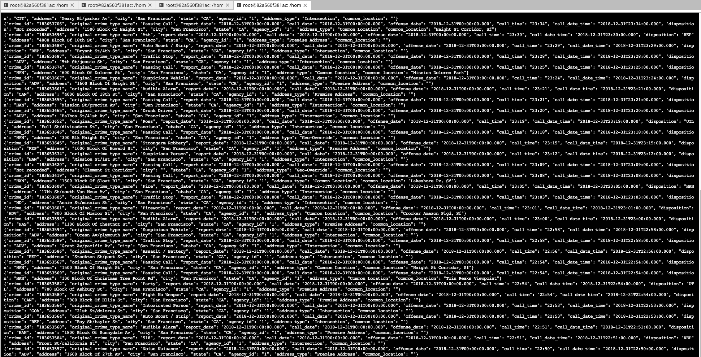
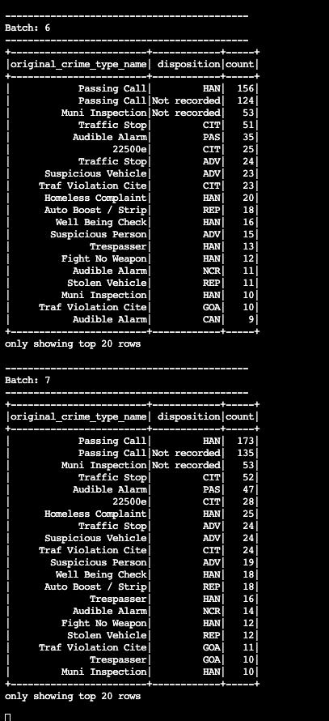
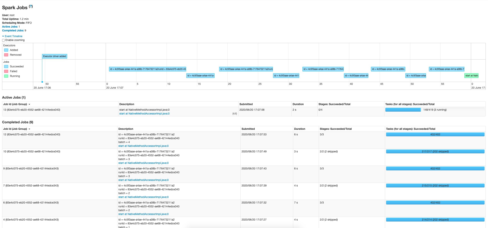
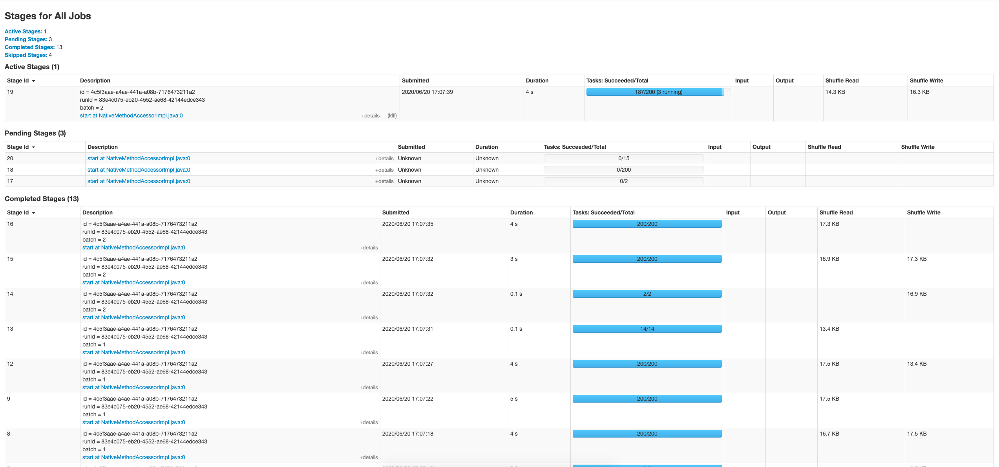

# Udacity Data Streaming Nanodegree

## SF Crime Statistics with Spark Streaming

1. **How did changing values on the SparkSession property parameters affect the throughput and latency of the data?**

    By changing the values on the SparkSession property parameters, it will affect the throughput. For some cases like `maxOffsetsPerTrigger`, the higher the value is, more message from kafka can be processed. If we have a producer that is producing message at very high rate, that may decrease consumer lag. Some parameters like `parallelism` allow spark to process our spark job at a higher rate as well. 

    Fine tuning these parameters to suit our use case will help in processing the spark job in an efficient way.

2. **What were the 2-3 most efficient SparkSession property key/value pairs? Through testing multiple variations on values, how can you tell these were the most optimal?**

    - `maxOffsetsPerTrigger`

         The higher `maxOffsetsPerTrigger` value is, the more message it can retrieve at one time. If we have a producer that is producing message at very high rate, increasing `maxOffsetsPerTrigger` may decrease consumer lag.
    - `maxRatePerPartition`

         `maxRatePerPartition` would be useful to make the stream process running at a efficient rate. This set the maximum rate for each partition, the higher the value the more message it can processed.

    - `parallelism`

        This is to allow the spark to be able to run executors in parallel and thus increasing the throughput of our spark job.

3. **Screenshots of work**

    - Console Consumer:

      

    - Spark Progress Reporter:

      
    - Spark UI Jobs:

      

    - Spark UI Stages:

      
